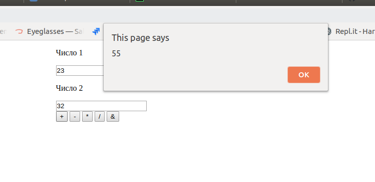

# home-work-QA
home work QA

Это калькулято может 1) складывать (первое число на второе) 2) отнимать (первое число на второе) 3) умножать (первое число на второе) 4) делить (первое число на второе) 5) возводить первое число в степень указав во втором поле

​
